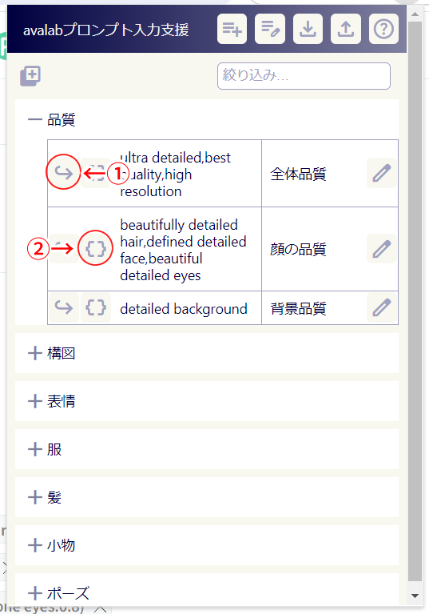
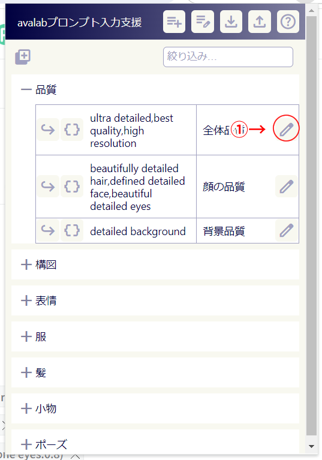
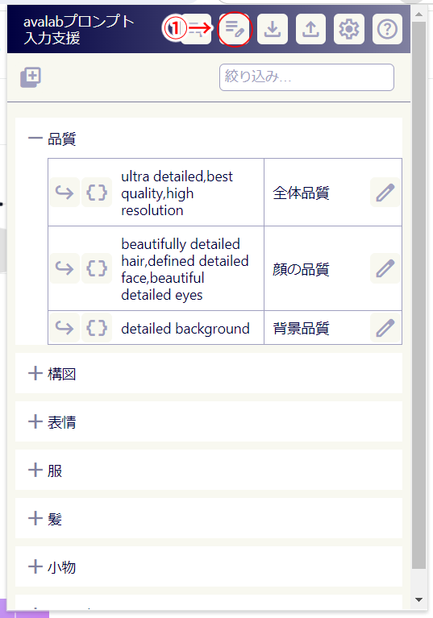
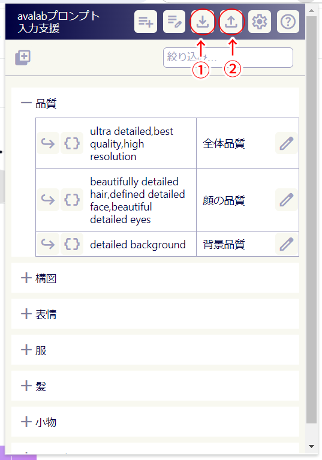

# Avalab.aiプロンプト入力支援ツール

このツールは[Avalab.ai](https://avalab.ai)でのプロンプト入力を支援するための、Chrome拡張機能です。

## インストール

[Chromeウェブストア](https://chromewebstore.google.com/detail/avalabai%E3%83%97%E3%83%AD%E3%83%B3%E3%83%97%E3%83%88%E5%85%A5%E5%8A%9B%E6%94%AF%E6%8F%B4%E3%83%84%E3%83%BC%E3%83%AB/okhnpkdkjhoehaiimadniembjdikncpa)からインストールしてください。

## 使い方

### プロンプトの挿入

- ①のアイコンをクリックすると、avalabにプロンプトを追加できます。
- ②のアイコンをクリックした場合、avalabのプロンプト入力欄に、`()`を付与した状態のプロンプトを入力します。必要があれば係数を調整して、avalabで「追加」操作を行ってください。

### プロンプトの追加

- ①のアイコンをクリックすると、プロンプト追加ダイアログが表示されます。

- プロンプト（必須）、備考（任意）を入力してください。プロンプト追加のアイコンをクリックしたカテゴリ内に、入力したプロンプトが追加されます。

### プロンプト編集

- ①のアイコンをクリックすると、プロンプト編集ダイアログが表示されます。

- プロンプト、備考を編集できます。
- 右下のゴミ箱アイコンをクリックするとプロンプトを削除できます。

### カテゴリ編集

- ①のアイコンをクリックすると、カテゴリ編集ダイアログが開きます。

- カテゴリ編集ダイアログでは、カテゴリ名の変更、カテゴリの並べ替え、カテゴリの追加、カテゴリの削除が行えます。

**注意：カテゴリを削除すると、カテゴリ内のプロンプトもすべて削除されます。**

### インポート/エクスポート

- ①のアイコンをクリックすると、現在のプロンプトの一覧をテキストファイルとしてダウンロードできます。
- ②のアイコンをクリックすると、テキストファイルからプロンプトを読み込んでこのツールに設定することができます。

インポート/エクスポートのファイル形式は[インポートファイル形式](importfile.md)を参照してください。  
[インポート用ファイルサンプル](sample.tsv)

**注意：インポートを行った場合、インポート前に設定されていたプロンプト情報はすべて削除されます。**

## ThirdPartyNotice

[本ソフトウェアが使用している外部ライブラリなどのライセンス](thirdPartyNotice.md)

## 連絡先（バグ報告/要望など）

以下のDiscordチャンネルをご利用ください。  
[兎摩の遊び場 - とまのツールのバグとか要望とか](https://discord.gg/QEyhHjMyKS)
